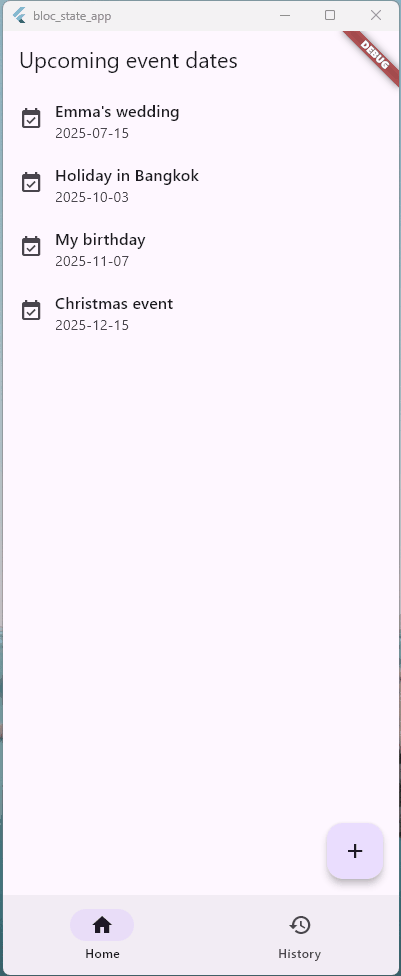

# page_routing_app

This is a Flutter project extended from [Flutter-go_router](https://github.com/ChiekoN/Flutter-go_router) project.

In the previous project, I explored how to implement **navigation and routing** in Flutter, by creating a very simple app that just lists some "important day" dates.

This time, I've added more functions and improvements, making it one (tiny) step closer to a real-world app. 
 - Created an actual form in Add Page where we can add a new item to the list.
 - Created a widget for Detail Page where we can see more information of the item.
 - Added a function to delete items from the list.
 - Added filters so that:
   - Top page shows the list that has only future dates (including today)
   - History page shows the list for past dates

<br/>




## Objective

To achieve these minimal but fundamental functionalities, **state management** is crucial. 

I first learned Flutter's primitive state management such as using a Stateful Widget. 

(See [State management (Flatter Docs)](https://docs.flutter.dev/get-started/fundamentals/state-management))

Then I explored [Bloc](https://bloclibrary.dev/) state management library which is suitable for more complex state management.

In this app, I implemented `Bloc` (more precisely, `Cubit`) to handle the change of list items. Additionally, `Stateful Widget` is used to handle input values on the form.


## State management using Bloc/Cubit

- Bloc document: [Bloc](ttps://bloclibrary.dev/)

- YouTube Tutorials:
  - [BLoC for Beginners 📱 State Management • Flutter Tutorial](https://youtu.be/rF6eq1oru-Y?si=2E24NUCJKqnNU90d)
  - [📱 Todo App (Clean Architecture) • Flutter x BLoC Tutorial](https://youtu.be/brDKUf1yV6c?si=o19q0ab0la-8lwrZ)

  These YouTube tutorials by [Mitch Koko](https://www.youtube.com/@createdbykoko) are great! It helped me to grab the concept of Bloc and how to write clean and organised code✨


## Code

Source code is organised like this:

```
lib
 ┣ data  // represents data layer
 ┃ ┣ models
 ┃ ┃ ┗ data_todate.dart
 ┃ ┗ repository
 ┃   ┗ data_todate_repo.dart
 ┣ domain  // represents domain layer
 ┃ ┣ models
 ┃ ┃ ┗ todate.dart
 ┃ ┗ repository
 ┃   ┗ todate_repo.dart
 ┣ feature  // represents feature/UI layer
 ┃ ┣ pages  // Widgets for each page
 ┃ ┃ ┣ add  // Add page
 ┃ ┃ ┃ ┗ add.dart
 ┃ ┃ ┣ detail  // Detail page 
 ┃ ┃ ┃ ┣ date_area.dart
 ┃ ┃ ┃ ┣ detail.dart
 ┃ ┃ ┃ ┣ history_detail.dart
 ┃ ┃ ┃ ┗ memo_area.dart
 ┃ ┃ ┣ history  // History list page
 ┃ ┃ ┃ ┗ history.dart
 ┃ ┃ ┗ toplist  // Home/top list page
 ┃ ┃   ┗ toplist.dart
 ┃ ┗ shared  // Widgets for controlling app UI
 ┃   ┣ app.dart
 ┃   ┣ bottom_navbar.dart
 ┃   ┣ router.dart
 ┃   ┣ todate_cubit.dart
 ┃   ┣ todate_provider.dart
 ┃   ┗ todate_rootview.dart
 ┗ main.dart
```

## Platform

In develpment, I selected Windows app as my target device.

## Flutter resources

A few resources to get you started if this is your first Flutter project:

- [Lab: Write your first Flutter app](https://docs.flutter.dev/get-started/codelab)
- [Cookbook: Useful Flutter samples](https://docs.flutter.dev/cookbook)

For help getting started with Flutter development, view the
[online documentation](https://docs.flutter.dev/), which offers tutorials,
samples, guidance on mobile development, and a full API reference.
